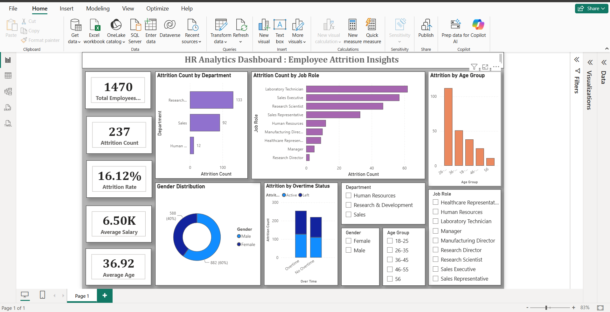

# hr-analytics-dashboard
Interactive HR Analytics dashboard built using Power BI to analyse employee attrition and workforce insights.

## 📌 Project Overview

This Power BI dashboard analyses employee attrition data to identify workforce trends and support HR decision-making.

---

## 🎯 Objective

To analyse employee attrition patterns based on department, job role, age group, gender, and overtime, helping HR teams understand factors influencing employee turnover.

---

## 🛠️ Tools & Technologies

- Power BI Desktop
- Power Query
- DAX
- CSV Dataset

---

## 📊 Dashboard Preview

🔗 **View Full Dashboard Image:** [Click Here](./DashBoard.png)

---

## 📈 Key KPIs

- Total Employees: 1470
- Attrition Count: 237
- Attrition Rate: 16.12%
- Average Salary: 6.50K
- Average Employee Age: 36.92 Years

---

## 📊 Dashboard Features

- Department-wise Attrition Analysis
- Job Role-wise Attrition
- Attrition by Age Group
- Gender Distribution
- Overtime Analysis
- Interactive Filters and Slicers

---

## 💡 Key Insights

- Research & Development recorded the highest employee attrition.
- Laboratory Technicians and Sales Executives experienced the highest attrition among job roles.
- Employees aged 26–35 showed the highest attrition.
- Employees working overtime had higher attrition compared to those without overtime.

---

## 🚀 Skills Demonstrated

- Data Cleaning
- Data Transformation
- Data Modelling
- DAX Measures
- Dashboard Design
- Data Visualisation
- HR Analytics

